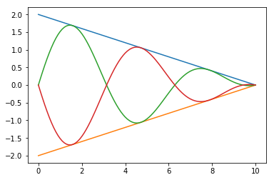

# Practice Plotting! (2)

To get you more comfortable with plotting graphs in Python, let's try plotting 4 functions on one set of axes!

**Task:** Write a program from scratch to plot the following functions between X=0 and X=10, with a spacing of 0.1 - make sure to **include** the final x-coordinate, X=10.

* ` Y1 = -0.2*X + 2`
* ` Y2 = 0.2*X - 2`
* ` Y3 = (-0.2*X+2)*(sin(X)) `
* ` Y4 = (0.2*X-2)*(sin(X)) `

## Solution
```python
from pylab import *

# x-coordinates
X = arange(0, 10.1, 0.1)
# function 1
Y1 = -0.2*X + 2
# function 2
Y2 = 0.2*X - 2
# function 3
Y3 = (-0.2*X+2)*(sin(X))
# function 4
Y4 = (0.2*X-2)*(sin(X))

# Plot:
plot(X,Y1)
plot(X,Y2)
plot(X,Y3)
plot(X,Y4)

show()
```

## Output

