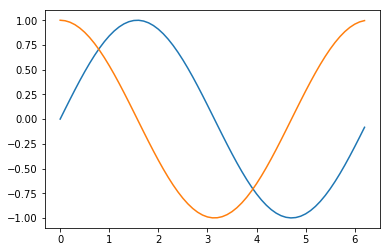

# Introduction to Graphs - Multiple Functions and Customization

It can be useful to plot multiple functions at once for comparison or visualization purposes. To do this, we can simply use the `plot` function twice with two different arrays of y-coordinates.

```python
from pylab import *

# x-coordinates
X = arange(0, 2*pi, 0.1)
# function 1
Y1 = sin(X)
# function 2
Y2 = cos(X)

# plot:
plot(X,Y1)
plot(X,Y2)
show()

```

The output is given below.



It can also be useful to customize these graphs. We can choose the type of lines/markers we use to plot, line thickness, colour, labelling, and more. For more details on customizing your plots, you can visit this web page:

https://matplotlib.org/xkcd/api/pyplot_api.html#matplotlib.pyplot.plot

Here's a quick example of how you might customize your graph.
```python
from pylab import *

# x-coordinates
X = arange(0, 2*pi, 0.1)
# function 1
Y1 = sin(X)
# function 2
Y2 = cos(X)

# plot:
plot(X,Y1,label='sin(x)','ro')
plot(X,Y2,label='cos(x)','g')
```

The output is given below:


