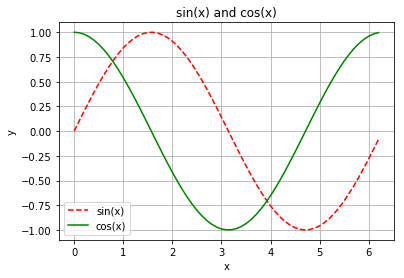

# Introduction to Graphs - Multiple Functions and Customization

It can be useful to plot multiple functions at once for comparison or visualization purposes. To do this, we can simply use the `plot` function twice with two different arrays of y-coordinates.

```python
from pylab import *

# x-coordinates
X = arange(0, 2*pi, 0.1)
# function 1
Y1 = sin(X)
# function 2
Y2 = cos(X)

# plot:
plot(X,Y1)
plot(X,Y2)
show()

```

The output is given below.


It can also be useful to customize these graphs. We can choose the type of lines/markers we use to plot, line thickness, colour, labelling, and more. If you would like more details on how to customize your plots, you can visit this web page:

https://matplotlib.org/xkcd/api/pyplot_api.html#matplotlib.pyplot.plot

Don't worry about memorizing the customization options - you can always look it up if necessary.
Here's a quick example of how you might customize your graph.
```python
from pylab import *

# x-coordinates
X = arange(0, 2*pi, 0.1)
# function 1
Y1 = sin(X)
# function 2
Y2 = cos(X)

# Plot:
# Red dashed line for sin(x)
plot(X,Y1,'r--', label='sin(x)')
# Green line for cos(x)
plot(X,Y2,'g', label='cos(x)')

# Titles and labels
title("sin(x) and cos(x)")
xlabel("x")
ylabel("y")

# Draw grid, create legend, and show the graph.
grid(True)
legend()
show()
```

The output graph is given below:



**Task:** Modify this program to also plot another function, `Y2 = X**2 + sin(X)`. Label the Y1 plot with "y = x^2" and the Y2 plot with "y = x^2 + sin(x)". Give it the title "x^2 and x^2+sin(12x)", and label the x-axis with "x" and y-axis with "y".

## Program
```python
from pylab import *

# x-coordinates
X = arange(-2*pi, 2*pi, 0.1)
# function 1
Y1 = X**2
# function 2


# Plot:
plot(X,Y1)


# Titles and labels:


legend()
show()
```

## Solution
```python
from pylab import *

# x-coordinates
X = arange(-2*pi, 2*pi, 0.1)
# function 1
Y1 = X**2
# function 2
Y2 = X**2+sin(12*X)

# Plot:
plot(X,Y1,label="y = x^2")
plot(X,Y2,label="y = x^2 + sin(x)")

# Titles and labels:
title("x^2 and x^2+sin(12x)")
xlabel("x")
ylabel("y")

legend()
show()
```

**Output:**

[!graph5](images/graph5.png)
